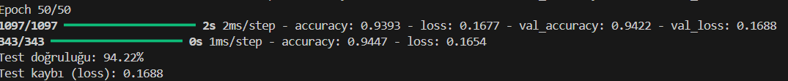
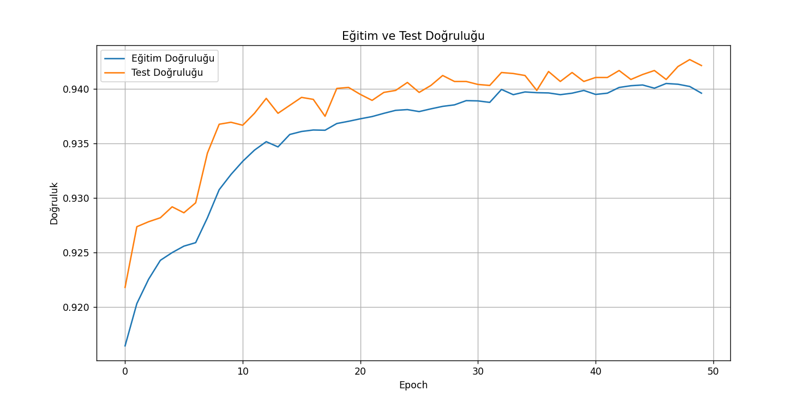
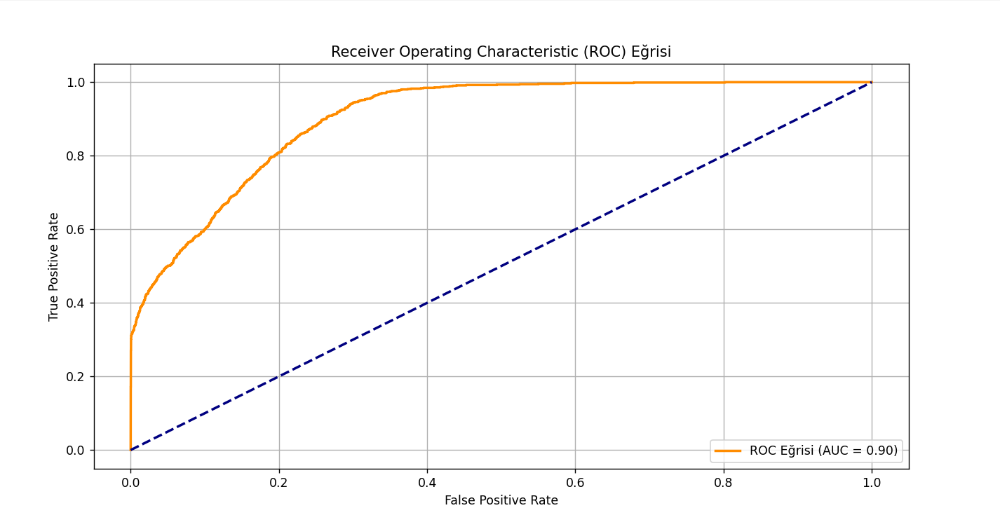

# -HR-Analysis-Employee-Promotion-Prediction-using-Artificial-Neural-Network
This project predicts employee promotions using an Artificial Neural Network (ANN) model. Trained on a dataset of 50,000 records, the model achieves 94% accuracy and a loss of 0.16, helping HR departments make data-driven promotion decisions.

## Screenshots

### Accuracy and Loss Values

### Train and Test Accuracy

### ROC Curve

